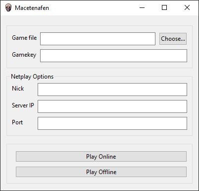

    

Macetenafen is a minimal GUI focused on netplay for mednafen powered by 
<a href="https://vuejs.org/">Vue.js</a> through <a href="https://vuido.mimec.org/">Vuido</a>

    <a href="https://github.com/fabricioanciaes/macetenafen/releases"
    style="
    background-color:#27233c;
    padding: 1rem;
    margin:1rem 1rem 3rem 1rem;
    display:block;
    width:100%;
    max-width:180px;
    box-shadow: 0 12px 24px -4px rgba(0,0,0,0.25), 0 4px 5px -3px rgba(0,0,0,0.5);
    border-radius:50px;
    font-size:18px;
    text-transform:Capitalize;
    color: rgba(255,255,255,0.8);
    text-decoration:none;
    ">
    Download here</a>

    

## Setup

1. Make sure you extract it alongside your mednafen executable
1. Run macetenafen.exe
1. Choose your game
1. Choose a gamekey (you and the person you're connecting to should use the same) 
1. Put in your nickname, server and port
1. Either press `Play Online` or `Play Offline`

---

#### Credits

Icon: https://twitter.com/ZapLayden/status/752067810956750848
